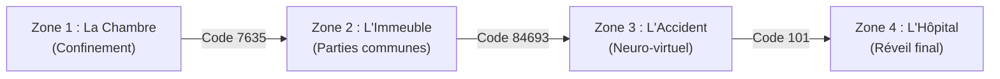

# 🚪 EscapAmnesia

<p align="center">
  
  
  
  
  
</p>

**EscapAmnesia** est un moteur de jeu d'évasion (Escape Game) narratif textuel propulsé par une API REST **FastAPI**. 

Plongé dans une ambiance dystopique et cyberpunk, le joueur incarne un sujet amnésique nommé **Etsilon**. Pour s'échapper et reconstituer la réalité de sa situation, il doit interagir avec son environnement, fouiller des conteneurs, combiner des objets, analyser des indices et résoudre des énigmes codées au fil de différentes zones.

---

## 📖 Sommaire

- [Synopsis & Univers](#-synopsis--univers)
- [Fonctionnalités Principales](#-fonctionnalités-principales)
- [Architecture & Conception POO](#-architecture--conception-poo)
- [Structure du Projet](#-structure-du-projet)
- [Installation & Lancement](#-installation--lancement)
  - [Option 1 : Avec Conda (Recommandé)](#option-1--avec-conda-recommandé)
  - [Option 2 : Avec venv / pip](#option-2--avec-venv--pip)
- [Documentation de l'API (Endpoints)](#-documentation-de-lapi-endpoints)
- [Déroulement du Jeu (Walkthrough)](#-déroulement-du-jeu-walkthrough)
- [Feuille de Route (Roadmap)](#-feuille-de-route-roadmap)

---

## 🌌 Synopsis & Univers



1. **Zone 1 - La Chambre (Confinement initial)** : Réveil en solitaire dans une pièce verrouillée. Vous devez inspecter les lieux, révéler des fréquences invisibles grâce à une lampe UV et déverrouiller la porte principale.
2. **Zone 2 - L'Immeuble (Escalier & Sas)** : Arrivée dans les parties communes. Le sas de sortie est privé de courant. Récupérez les composants nécessaires sur un drone HS et dans la cage d'ascenseur pour réactiver le terminal mural.
3. **Zone 3 - L'Accident / La Sauvegarde (Espace Neuro-Virtuel)** : Basculement dans le coma. Une interface de simulation cérébrale prend le relais. Il faut insérer la bande de données et calibrer les signaux d'ondes pour restaurer la mémoire.
4. **Zone 4 - L'Hôpital (Réveil)** : Fin de la simulation et retour à la réalité.

---

## ✨ Fonctionnalités Principales

- **Moteur de progression par étapes** : Enchaînement de salles avec gestion des états (`en_jeu`, `fini`).
- **Gestionnaire d'inventaire** : Capacité définie, ajout, retrait et consultation d'objets possédés.
- **Objets interactifs & Conteneurs** : Objets dotés de propriétés de verrouillage, d'inspection et d'utilisation.
- **Système d'indices contextuels** : Possibilité de requêter des pistes adaptées au niveau actuel.
- **Documentation interactive Swagger & OpenAPI** : Test direct des routes et des requêtes dans le navigateur.

---

## 🏗 Architecture & Conception POO

Le backend repose sur une architecture orientée objet modulaire :

```
Item (Classe de base abstraite)
 │
 ├── Conteneur (Objets ouvrables contenant des items, ex: Drone)
 ├── ObjetInteractif (Mécanismes verrouillés / terminaux, ex: Digicode, Coffre)
 └── Inventory (Gestionnaire d'items portés par le joueur)

Salle (Représente un niveau, ses objets, son scénario, son code de déverrouillage)
SessionManager (Contrôleur de partie : niveau actuel, timer, transition de niveau)
```

---

## 📂 Structure du Projet

```text
EscapAmnesia/
├── app/
│   ├── Conteneur.py          # Sous-classe Item pour les objets conteneurs
│   ├── Inventory.py          # Logique du sac / inventaire joueur
│   ├── Item.py               # Classe mère abstraite des objets
│   ├── ItemsList.py          # Définitions et instanciations de tous les objets du jeu
│   ├── ObjetInteractif.py    # Sous-classe Item pour les mécanismes et puzzles
│   ├── requirements.txt      # Liste des dépendances Python
│   ├── Salle.py              # Classe modélisant une pièce et ses énigmes
│   └── SessionManager.py     # Contrôleur d'état de partie et logique des niveaux
├── environment.yml           # Fichier de configuration de l'environnement Conda
├── main.py                   # Point d'entrée de l'application FastAPI et déclaration des routes
└── README.md                 # Documentation du projet
```

---

## 🚀 Installation & Lancement

### Prérequis

- [Python](https://www.python.org/) (>= 3.11)
- [Conda / Miniconda](https://docs.conda.io/en/latest/) (recommandé) ou `pip`

---

### Option 1 : Avec Conda (Recommandé)

1. **Cloner le dépôt :**
   ```bash
   git clone https://github.com/Romain-g-make/EscapAmnesia.git
   cd EscapAmnesia
   ```

2. **Créer l'environnement Conda :**
   ```bash
   conda env create -f environment.yml
   ```

3. **Activer l'environnement :**
   ```bash
   conda activate escape_engine
   ```

4. **Lancer le serveur de développement :**
   ```bash
   uvicorn main:app --reload
   ```

---

### Option 2 : Avec venv / pip

1. **Créer et activer un environnement virtuel :**
   ```bash
   python -m venv .venv
   source .venv/bin/activate  # Sur Linux/macOS
   # .venv\Scripts\activate   # Sur Windows
   ```

2. **Installer les dépendances :**
   ```bash
   pip install -r app/requirements.txt
   ```

3. **Lancer l'API :**
   ```bash
   uvicorn main:app --reload
   ```

---

## 🌐 Documentation de l'API (Endpoints)

Une fois l'application démarrée, retrouvez la documentation interactive Swagger UI sur :
👉 **[http://127.0.0.1:8000/docs](http://127.0.0.1:8000/docs)** (ou ReDoc sur `http://127.0.0.1:8000/redoc`).

### Récapitulatif des Routes

| Méthode | Route | Description |
| :--- | :--- | :--- |
| `GET` | `/` | Test de bon fonctionnement de l'API et de l'environnement |
| `GET` | `/start` | Initialise une nouvelle partie (`SessionManager`) |
| `GET` | `/room/get` | Récupère les données de la salle courante (nom, scénario, état) |
| `GET` | `/objet/get` | Liste tous les objets et dispositifs présents dans la salle actuelle |
| `GET` | `/indice` | Fournit l'indice narratif associé à l'énigme en cours |
| `GET` | `/tryescape/{code}` | Tente de résoudre l'énigme et déverrouiller la salle suivante |
| `GET` | `/inventory/showInventory` | Affiche les objets actuellement détenus dans l'inventaire |
| `PATCH` | `/inventory/addItem/{itemId}` | Ajoute un item spécifique dans l'inventaire |
| `PATCH` | `/inventory/removeItem/{itemId}` | Retire un item de l'inventaire |

---

## 🕹 Déroulement du Jeu (Walkthrough)

Exemple de cycle de jeu via requêtes HTTP :

1. **Initialiser la session :**
   ```bash
   curl -X GET "http://127.0.0.1:8000/start"
   ```

2. **Lire le scénario de la pièce :**
   ```bash
   curl -X GET "http://127.0.0.1:8000/room/get"
   ```

3. **Consulter les objets disponibles :**
   ```bash
   curl -X GET "http://127.0.0.1:8000/objet/get"
   ```

4. **Demander un indice en cas de blocage :**
   ```bash
   curl -X GET "http://127.0.0.1:8000/indice"
   ```

5. **Tenter d'ouvrir la porte vers le niveau suivant :**
   ```bash
   curl -X GET "http://127.0.0.1:8000/tryescape/7635"
   ```

---

## 🗺 Feuille de Route (Roadmap)

- [ ] **Multi-sessions** : Gestion d'identifiants de session dynamiques par joueur (UUID / token).
- [ ] **Persistance en base de données** : Intégration de PostgreSQL / SQLAlchemy (déjà présent dans l'environnement) pour sauvegarder les parties.
- [ ] **Minuteur actif** : Décompte réel du temps restant avec fin de partie (`endGame`) en cas d'expiration.
- [ ] **Interactions combinées** : Système d'utilisation conjointe d'objets (ex: `utiliser(pile, terminal)`).
- [ ] **Interface Frontend** : Web app ou TUI (Text User Interface) pour jouer directement sans client d'API.

---

## 👥 Auteurs

Projet développé dans le cadre du projet **EscapAmnesia**.

