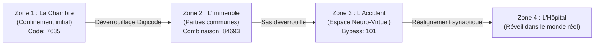
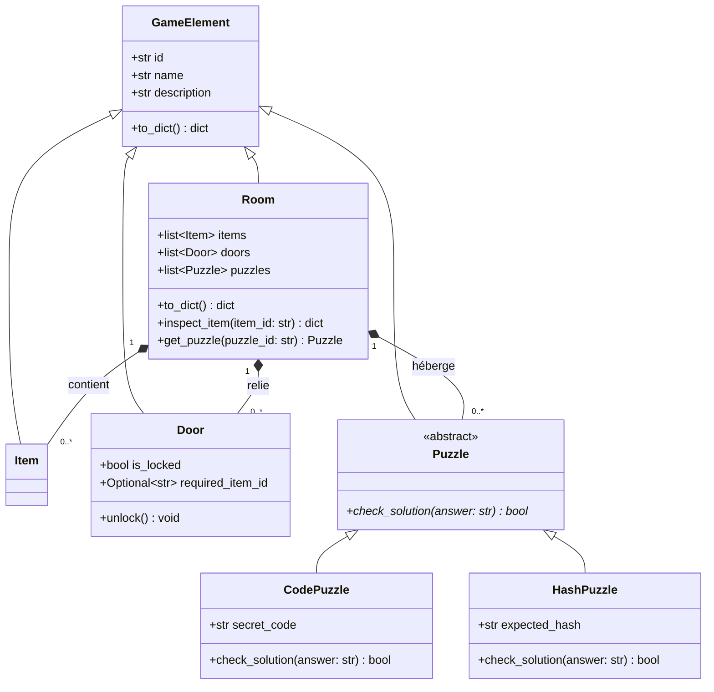

# 🚪 EscapAmnesia

<p align="center">
  
  
  
  
  
</p>

> **EscapAmnesia** est un moteur de jeu d'évasion (Escape Game) narratif et interactif propulsé par une API REST **FastAPI**.  
> Le projet s'appuie sur une conception **Orientée Objet pure** (dataclasses, polymorphisme, typage strict, cryptographie SHA-256) et une validation stricte des requêtes via **Pydantic**.

---

## 📋 Sommaire

1. [Cadrage du Scénario & Univers](#-cadrage-du-scénario--univers)
2. [Déroulement Narratif (4 Zones)](#-déroulement-narratif-4-zones)
3. [Architecture & Conception POO](#-architecture--conception-poo)
   - [Diagramme de Classes Mermaid](#-diagramme-de-classes-mermaid)
4. [Arborescence du Projet](#-arborescence-du-projet)
5. [Installation & Démarrage](#-installation--démarrage)
6. [Documentation des Endpoints REST](#-documentation-des-endpoints-rest)
7. [Validation & Tests Automatisés](#-validation--tests-automatisés)
   - [Tests Unitaires Pytest](#1-tests-unitaires-pytest)
   - [Script d'Évasion Complète (partieentiere.sh)](#2-script-dévasion-complète-partieentieresh)
8. [Cycle de Jeu Exemple (Walkthrough cURL)](#-cycle-de-jeu-exemple-walkthrough-curl)

---

## 🌌 Cadrage du Scénario & Univers

*Projet développé dans le cadre de la mission **DigitalEscape Studio**.*

| Paramètre | Définition |
| :--- | :--- |
| **Titre du Jeu** | **EscapAmnesia** |
| **Thématique** | Dystopie Cyberpunk / Confinement / Simulation Neuro-Virtuelle |
| **Protagoniste** | Sujet amnésique sous le matricule **Etsilon** |
| **Game Master** | **IA-Sentinel** (Intelligence Artificielle de surveillance et de monitoring neurologique) |
| **Objectif** | Retrouver sa mémoire et s'évader à travers 4 zones interconnectées |

---

## 🗺️ Déroulement Narratif (4 Zones)


```mermaid
flowchart LR
    Z1["Zone 1 : La Chambre\n(Confinement initial)\nCode: 7635"] -->|"Déverrouillage Digicode"| Z2["Zone 2 : L'Immeuble\n(Parties communes)\nCombinaison: 84693"]
    Z2 -->|"Sas déverrouillé"| Z3["Zone 3 : L'Accident\n(Espace Neuro-Virtuel)\nBypass: 101"]
    Z3 -->|"Réalignement synaptique"| Z4["Zone 4 : L'Hôpital\n(Réveil dans le monde réel)"]
```

1. **Zone 1 — La Chambre (Confinement initial)** :  
   Réveil solitaire dans une pièce inconnue aux grattes-ciels sombres. Le joueur doit inspecter son environnement, révéler le schéma secret sous le lit avec la lampe UV pour ouvrir le coffre quantique, récupérer l'oculomètre et composer le code `7635` sur la porte blindée.
2. **Zone 2 — L'Immeuble (Escalier & Sas de sortie)** :  
   Arrivée dans les parties communes. Le sas de sortie haute tension est privé d'alimentation. Le joueur récupère la pile lithium `84` dans un drone suspendu et la carte de déchiffrement `693` dans l'ascenseur pour réarmer le Terminal de Décharge mural et saisir la combinaison `84693`.
3. **Zone 3 — L'Accident / La Sauvegarde (Espace Neuro-Virtuel)** :  
   Un accident survient et le corps d'Etsilon bascule dans le coma. L'IA-Sentinel déclenche un protocole de sauvegarde neuro-virtuel. En insérant la bande de données dans l'Analyseur, le joueur découvre la calibration tricanale et aligne les interrupteurs sur `101`.
4. **Zone 4 — L'Hôpital (Réveil final)** :  
   *« Bonjour Etsilon, comment vas-tu ? »* La simulation prend fin et le joueur se réveille en sécurité dans le monde réel.

---

## 🏗️ Architecture & Conception POO

Le code métier respecte une stricte séparation des responsabilités :
- **Dataclasses & Typage** : Modélisation robuste via `@dataclass` et type hints (`str`, `int`, `list`, `Optional`).
- **Héritage** : `GameElement` est la classe mère générale dotée de `id`, `name`, `description` et de sa méthode de sérialisation `to_dict()`. `Item`, `Door` et `Room` en héritent.
- **Polymorphisme & Cryptographie** :  
  - Classe abstraite `Puzzle` avec méthode `@abstractmethod def check_solution(answer: str) -> bool`.
  - `CodePuzzle` : comparaison directe de code secret en texte clair.
  - `HashPuzzle` : focus sécurité informatique — aucune clé en clair, calcul dynamique de l'empreinte **SHA-256** de la saisie utilisateur.
- **Gestion de Session & Inventaire** : Le `SessionManager` gère l'état d'avancement, le chronomètre et l'inventaire dynamique du joueur.

### 📐 Diagramme de Classes Mermaid


```mermaid
classDiagram
    class GameElement {
        +str id
        +str name
        +str description
        +to_dict() dict
    }

    class Item {
    }

    class Door {
        +bool is_locked
        +Optional~str~ required_item_id
        +unlock() void
    }

    class Puzzle {
        <<abstract>>
        +check_solution(answer: str)* bool
    }

    class CodePuzzle {
        +str secret_code
        +check_solution(answer: str) bool
    }

    class HashPuzzle {
        +str expected_hash
        +check_solution(answer: str) bool
    }

    class Room {
        +list~Item~ items
        +list~Door~ doors
        +list~Puzzle~ puzzles
        +to_dict() dict
        +inspect_item(item_id: str) dict
        +get_puzzle(puzzle_id: str) Puzzle
    }

    GameElement <|-- Item
    GameElement <|-- Door
    GameElement <|-- Puzzle
    GameElement <|-- Room

    Puzzle <|-- CodePuzzle
    Puzzle <|-- HashPuzzle

    Room "1" *-- "0..*" Item : contient
    Room "1" *-- "0..*" Door : relie
    Room "1" *-- "0..*" Puzzle : héberge
```

---

## 📂 Arborescence du Projet

```text
EscapAmnesia/
├── app/
│   ├── domain/               # POO Pure (Dataclasses, Héritage, Polymorphisme)
│   │   ├── __init__.py
│   │   ├── door.py           # Classe Door (is_locked, required_item_id)
│   │   ├── game_element.py   # Classe de base GameElement (id, name, description, to_dict)
│   │   ├── item.py           # Classe Item
│   │   ├── puzzle.py         # Puzzle (abstrait), CodePuzzle et HashPuzzle (SHA-256)
│   │   └── room.py           # Classe Room (composition items, doors, puzzles)
│   ├── models/               # Modèles de session et moteur de jeu interactif
│   │   ├── Conteneur.py      # Coffres et boîtiers ouvrables
│   │   ├── Inventory.py      # Inventaire dynamique du joueur
│   │   ├── Item.py           # Modèle Item legacy
│   │   ├── ObjetInteractif.py# Mécanismes et combinatoires d'objets
│   │   ├── Salle.py          # Modélisation d'une zone et code d'issue
│   │   └── SessionManager.py # Contrôleur de session de jeu et progression
│   ├── routers/              # Contrôleurs API REST FastAPI
│   │   ├── game_router.py    # Démarrage et suppression de partie (/start, DELETE)
│   │   ├── inventory_router.py # Manipulation du sac joueur (addItem, removeItem, show)
│   │   ├── object_router.py  # Consultation, inspection et interaction d'objets
│   │   ├── player_game.py    # Endpoints exploration (/rooms, /puzzles/submit)
│   │   └── room_router.py    # Données de salle, indices et tentative d'évasion
│   ├── schemas/              # Schémas de validation Pydantic v2
│   │   ├── __init__.py
│   │   └── puzzle.py         # PuzzleSubmission (validation anti-chaîne vide -> 422)
│   ├── services/
│   │   ├── ItemsList.py      # Instanciations des articles et dispositifs interactifs
│   │   └── scenario.py       # Scénario complet du domaine
│   ├── main.py               # Point d'entrée de l'application FastAPI
│   └── requirements.txt      # Dépendances Python
├── tests/
│   ├── test_domain.py        # 6 tests unitaires POO (héritage, SHA-256, to_dict)
│   └── partie_entiere.sh     # Script shell d'exécution complète de l'évasion
├── partieentiere.sh           # Raccourci d'exécution du test complet
├── pytest.ini                # Configuration Pytest
└── README.md                 # Documentation du projet
```

---

## 🚀 Installation & Démarrage

### 1. Prérequis
* **Python 3.11+** (recommandé : Python 3.12)
* `pip` ou `conda`

### 2. Cloner et configurer l'environnement

```bash
# Cloner le dépôt
git clone https://github.com/Romain-g-make/EscapAmnesia.git
cd EscapAmnesia

# Créer un environnement virtuel
python3 -m venv .venv
source .venv/bin/activate  # Sur Linux/macOS
# .venv\Scripts\activate   # Sur Windows

# Installer les dépendances
pip install -r app/requirements.txt
```

### 3. Lancer le serveur FastAPI

```bash
uvicorn app.main:app --reload
```

* Le serveur démarre sur : **`http://127.0.0.1:8000`**
* **Documentation interactive Swagger UI** : 👉 [http://127.0.0.1:8000/docs](http://127.0.0.1:8000/docs)
* **Documentation alternative ReDoc** : 👉 [http://127.0.0.1:8000/redoc](http://127.0.0.1:8000/redoc)

---

## 🌐 Documentation des Endpoints REST

### 1. Contrôle & Exploration Globale
| Méthode | Route | Description |
| :--- | :--- | :--- |
| `GET` | `/health` | Retourne `{"status": "online", "game_title": "EscapAmnesia", "engine_version": "1.0.0"}` |
| `GET` | `/` | Contrôle d'état et lien vers la documentation `/docs` |
| `GET` | `/rooms` | Liste l'ensemble des salles du scénario |
| `GET` | `/rooms/{room_id}` | Détail d'une salle avec ses objets, portes et énigmes |
| `POST` | `/puzzles/submit` | Soumission d'une tentative (Pydantic v2, renvoie `422` si vide) |

### 2. Gestion de Session de Partie
| Méthode | Route | Description |
| :--- | :--- | :--- |
| `POST` | `/start` | Initialise une nouvelle session de jeu et génère son UUID |
| `DELETE` | `/{idGame}` | Supprime et clôture la partie indiquée |

### 3. Progression & Salles
| Méthode | Route | Description |
| :--- | :--- | :--- |
| `GET` | `/{idGame}/room/get` | Récupère le nom, le scénario et l'état de la salle courante |
| `GET` | `/{idGame}/indice` | Fournit l'indice narratif associé à l'énigme en cours |
| `PATCH` | `/{idGame}/tryescape/{code}` | Tente de déverrouiller la porte vers la zone suivante avec un code |

### 4. Inventaire du Joueur
| Méthode | Route | Description |
| :--- | :--- | :--- |
| `GET` | `/{idGame}/inventory/showInventory` | Affiche les objets actuellement possédés par le joueur |
| `PATCH` | `/{idGame}/inventory/addItem/{itemId}` | Ajoute un objet au sac du joueur |
| `DELETE` | `/{idGame}/inventory/removeItem/{itemId}` | Retire un objet de l'inventaire |

### 5. Objets & Interactions
| Méthode | Route | Description |
| :--- | :--- | :--- |
| `GET` | `/{idGame}/objet/get` | Liste les objets présents dans la pièce actuelle |
| `GET` | `/{idGame}/objet/inspect/{itemId}` | Inspecte un objet (coffre, terminal, prop) |
| `PATCH` | `/{idGame}/objets/interact/{id1}-{id2}` | Combine ou utilise un objet de l'inventaire sur un dispositif |

---

## 🧪 Validation & Tests Automatisés

### 1. Tests Unitaires Pytest

Une suite de tests vérifie l'architecture orientée objet (héritage, polymorphisme, validation cryptographique SHA-256, sérialisation) :

```bash
pytest -v
```

**Résultat attendu :**
```text
tests/test_domain.py::test_game_element_to_dict PASSED           [ 16%]
tests/test_domain.py::test_item_inheritance PASSED               [ 33%]
tests/test_domain.py::test_door_attributes_and_unlock PASSED     [ 50%]
tests/test_domain.py::test_code_puzzle_check_solution PASSED     [ 66%]
tests/test_domain.py::test_hash_puzzle_sha256_check_solution PASSED [ 83%]
tests/test_domain.py::test_room_composition_and_to_dict PASSED   [100%]
============================== 6 passed in 0.04s ===============================
```

### 2. Script d'Évasion Complète (`partieentiere.sh`)

Un script Bash complet simule une partie intégrale de A à Z (de la création de session au réveil en Zone 4) :

```bash
# Vérifier que le serveur est démarré dans un premier terminal :
uvicorn app.main:app --reload

# Lancer la simulation dans un second terminal :
./partieentiere.sh
```

---

## 🕹️ Cycle de Jeu Exemple (Walkthrough cURL)

Voici un exemple pas-à-pas pour jouer directement en ligne de commande :

```bash
# 1. Démarrer une nouvelle partie
RESPONSE=$(curl -s -X POST -H "Content-Type: application/json" \
  -d '{"etat":"en_jeu","temps_restant":3600,"niveau_actuel":1}' \
  http://127.0.0.1:8000/start)
ID=$(echo $RESPONSE | python3 -c "import sys, json; print(json.load(sys.stdin)['id'])")
echo "Partie ID: $ID"

# 2. Inspecter la Chambre et ramasser la lampe UV (#1)
curl -X GET "http://127.0.0.1:8000/$ID/room/get"
curl -X PATCH "http://127.0.0.1:8000/$ID/inventory/addItem/1"

# 3. Inspecter le Coffre Quantique (#2) et récupérer l'Oculomètre (#4)
curl -X GET "http://127.0.0.1:8000/$ID/objet/inspect/2"
curl -X PATCH "http://127.0.0.1:8000/$ID/inventory/addItem/4"

# 4. Ouvrir la porte de la chambre avec le code 7635
curl -X PATCH "http://127.0.0.1:8000/$ID/tryescape/7635"

# 5. Zone 2 : Récupérer la pile (84) et la puce (693), puis alimenter le terminal (#8)
curl -X PATCH "http://127.0.0.1:8000/$ID/inventory/addItem/6"
curl -X PATCH "http://127.0.0.1:8000/$ID/inventory/addItem/7"
curl -X PATCH "http://127.0.0.1:8000/$ID/objets/interact/8-6"

# 6. Déverrouiller le Sas avec le code 84693
curl -X PATCH "http://127.0.0.1:8000/$ID/tryescape/84693"

# 7. Zone 3 : Récupérer la bande (#11) et l'analyser dans la console (#9)
curl -X PATCH "http://127.0.0.1:8000/$ID/inventory/addItem/11"
curl -X PATCH "http://127.0.0.1:8000/$ID/objets/interact/9-11"

# 8. Alignement synaptique sur 101 et sortie finale
curl -X PATCH "http://127.0.0.1:8000/$ID/tryescape/101"

# 9. Clôture de la partie
curl -X DELETE "http://127.0.0.1:8000/$ID"
```

---

## 👥 Auteurs & Licence

* Développé par l'équipe **EscapAmnesia** dans le cadre du cursus de développement d'Escape Game interactif.
* Projet sous licence open-source MIT.
